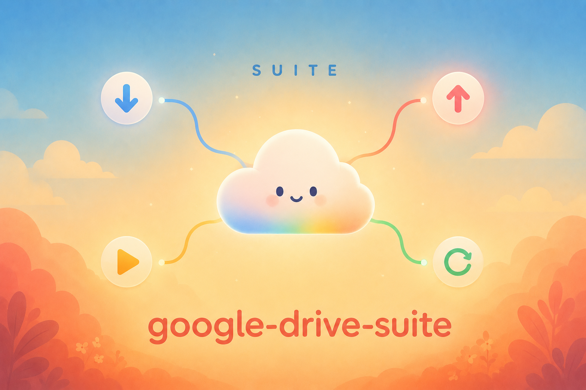

<!--
SEO / GitHub metadata (apply manually in repo settings — not rendered by GitHub):

Topics (18, ranked): google-drive, google-shared-drive, rclone, download-manager,
        bulk-download, file-upload, media-server, streaming, self-hosted, web-ui,
        android-tv, fire-tv, flask, fastapi, kotlin, jetpack-compose, macos,
        cloud-storage

About field (chosen: #1 — front-loads every pillar query verbatim):
"Bulk download, parallel upload, stream & auto-offload for Google Shared Drives —
a self-hosted suite of local web UIs, a Fire TV app, and daemons on rclone."
(156 chars)

Also set the social preview image (Settings → General) to docs/media/hero.png
at 1280×640 once it exists — that's what renders when the repo link is shared.
-->

# Google Drive Suite

**Move it, stream it, offload it — your Drive without the slow parts.**

*Drivedeck — four self-hosted power tools for Google Drive, one shared engine.*

<!--  — see docs/media/README.md for the asset plan -->

## The suite

Four tools, one engine (rclone + the Drive API), zero hosting. Pick what you need — each works standalone.

| I want to… | Tool | What it is |
|---|---|---|
| **Download** in bulk | [`toolkit/`](toolkit/) → `gdrive-download` | Web UI: tick a checkbox tree over any Shared Drive, pull it in parallel with live progress |
| **Upload** in parallel | [`toolkit/`](toolkit/) → `gdrive-upload` | Copy-only uploads with a native macOS picker — never touches your local files |
| **Control** it all | [`toolkit/`](toolkit/) → `gdrive-hub` | macOS menu-bar hub: live status + one-click launch for every tool here |
| **Stream** my Drive | [`drivecast/`](drivecast/) | Your Shared Drives as a poster-tile media library — movies, shows, courses — streamed to mpv/VLC/browser, nothing written to disk |
| **Watch** on the TV | [`drivecast-app/`](drivecast-app/) | Native Fire TV / Android TV client for drivecast (Kotlin + Compose) — grab the APK from Releases |
| **Offload** automatically | [`drive-offload/`](drive-offload/) | Daemon that moves finished downloads to Shared Drives and keeps a full disk clear |

The suite spans Python web services, a macOS menu-bar app, and a native Kotlin/Compose TV client — same design language, same server contract.

## Start here

Everything needs [rclone](https://rclone.org) with a configured remote (`rclone config`) — that's your auth; nothing here ever sees your Google password.

- **Transfer files** → clone this repo, then `pip install -e './toolkit[all]'`, then `gdrive-setup && gdrive-download` — [toolkit/README](toolkit/README.md) *(PyPI package coming; install from source for now)*
- **Stream your library** → [drivecast/README](drivecast/README.md) (venv + `python app.py`, opens at 127.0.0.1:8737)
- **Watch on TV** → install the latest APK from Releases — no build needed — [drivecast-app/README](drivecast-app/README.md)
- **Auto-offload downloads** → [drive-offload/README](drive-offload/README.md)

> **How this was built.** The whole suite was designed and shipped through a
> spec-first, multi-agent AI workflow — a designer model writing specs, an
> orchestrator verifying against them, an executor writing code, and a human
> accepting each stage. The process, with real spec-to-code traces, is
> documented in **[BUILD-WITH-AI.md](BUILD-WITH-AI.md)** — written to transfer,
> not to impress.

> **Why a value is that value.** Measurements that overturned an assumption,
> and constraints the code is shaped around, are logged in
> **[docs/DECISIONS.md](docs/DECISIONS.md)** — including the one that says
> "faster downloader" and "more connections" are not the same thing.

## Security model

- **Binds `127.0.0.1` only.** No tool in this suite listens on any other interface by default.
- **Auth is your own `rclone` OAuth token** — nothing is hosted, nothing phones home.
- **Upload is copy-only; streaming is read-only.** The one tool that deletes anything (drive-offload's watcher) refuses to run against a non-dedicated folder.
- **Remote access beyond localhost is opt-in and tokened** (drivecast's phone/TV access) or **your VPN's job** (the toolkit) — never exposed to the open internet as-is.
- Full detail — daemon auth, Host/Origin checks, certificate handling — lives in each component's own README.

## Where the standalone repos went

This suite consolidates four repos that previously lived separately
(`google-shared-drive-toolkit`, `drivecast`, `drivecast-app`, `drive-offload`).
Each was imported here as a snapshot of its current code; their **full commit
history lives in the original repos, which are archived (read-only) and point
back to this one**. Existing release APKs stay downloadable from the archived
`drivecast-app` repo until this suite publishes its own releases.

## Trademark

Not affiliated with, endorsed by, or sponsored by Google LLC. Google Drive™
and Google Workspace™ are trademarks of Google LLC. This is an independent
open-source client that interoperates with Google Drive via your own account
and your own `rclone` installation. No Google branding, logos, or trade dress
are used in this project.

## License

MIT — see [LICENSE](LICENSE).
